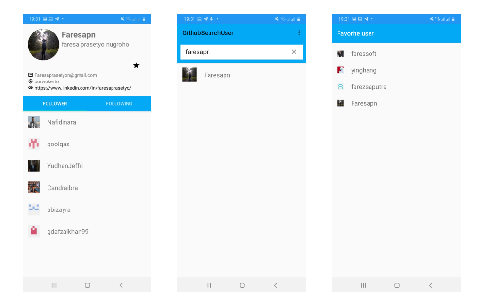

# Aplikasi Github Search User 

Aplikasi Github Search User Merupakan Aplikasi Tugas Akhir Dari Course Dicoding.com Belajar Fundamental Aplikasi Android dengan fitur2 :
1. Daily Reminder
2. Menambahkan User Favorite dengan SQLITE 
3. Pencarian User Github
4. Melihat Detail User
5. Melihat Follower dan Following User

Dibangun Menggunakan :
1. MVVM Architecture
2. Penyimpanan Lokal SQLITE
3. Retrofit
4. Content Provider

# Noted
**DILARANG KERAS PLAGIAT GUNAKAN SOURCE CODE HANYA SEBAGAI REFERENSI**

**GUNAKAN API KEY GITHUB ANDA SENDIRI**

